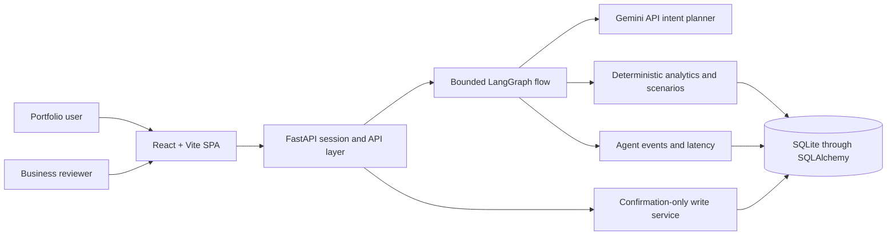

# EstatePulse — AI Real Estate Portfolio Analyst

EstatePulse is a modern conversational portfolio analyst built for the supplied engineering assignment. It answers questions from stored property data, performs deterministic calculations, carries context across turns, models temporary what-if scenarios, and prepares reviewed property changes. A separate business dashboard exposes conversations, agent activity, latency, failures, and attention flags.

The included data is synthetic. The UI simulates a polished messaging experience without integrating WhatsApp.

## What works

- Portfolio summaries, filtering, value exposure, rent and gross rental yield
- Contextual follow-ups and property/category comparisons
- Hypothetical exclusions and value changes kept separate from actual holdings
- Add/update proposals with explicit confirmation before persistence
- Four isolated demo personas backed by the supplied dataset
- Persistent conversations and structured result cards
- Incremental response streaming with a durable final message
- Gemini intent planning with a deterministic fallback when no key is configured
- Millisecond local routing for common questions, with pooled Gemini connections for nuanced requests
- Business dashboard with messages, agent activity, latency, failures, and attention flags
- Responsive React interface for mobile and desktop

## Architecture



Gemini interprets language. Python retrieves records, enforces user scope, performs arithmetic, applies scenarios, validates changes, and renders numerical cards. A scenario cannot write a property. A proposed actual change cannot commit until the user selects **Confirm & save**.

For the assignment workload, SQLite is the simplest durable store. Repository boundaries, explicit user scoping, relational constraints, and revision fields provide a direct path to PostgreSQL when multiple instances are required.

## Local setup

Requirements: Python 3.13, [uv](https://docs.astral.sh/uv/), Node.js 22+, and npm.

```powershell
Copy-Item .env.example backend/.env
cd backend
uv sync --frozen
uv run python -m app.seed --data-dir ../data
uv run uvicorn app.main:app --reload --port 8000
```

In another terminal:

```powershell
cd frontend
npm ci
npm run dev
```

Open `http://localhost:5173`. The default local demo access code is `demo`; the admin token is `admin-demo`. Change both outside local development.

To enable Gemini, place the key only in `backend/.env`:

```dotenv
GEMINI_API_KEY=your-key-here
GEMINI_MODEL=gemini-2.5-flash
```

Never commit `.env`. Without a key, EstatePulse uses a deterministic intent fallback so the UI and calculations remain demonstrable; `/health/ready` reports the active mode.

## Verification

```powershell
cd backend
uv run ruff check .
uv run pytest -q

cd ../frontend
npm run lint
npm run typecheck
npm run test -- --run
npm run build
```

Golden seed expectations include Rahul's ₹29.70 Cr portfolio, ₹1.32 Cr annual rent, and 71.38% retail value exposure. Tests cover money parsing, normalization, portfolio arithmetic, scenario immutability, session-scoped reads, grounded chat output, and confirmation-before-write behavior.

## Deployment

`render.yaml` defines one Docker web service with a persistent disk at `/var/data`. Configure `GEMINI_API_KEY`, `DEMO_ACCESS_CODE`, `ADMIN_TOKEN`, `FRONTEND_ORIGIN`, and `SESSION_SECRET` in Render. The image builds the frontend, serves it from FastAPI, seeds missing records idempotently, and runs one worker because SQLite uses local storage.

For higher concurrency, migrate the SQLAlchemy models to PostgreSQL, add Alembic migrations and database-backed serialization, then run stateless API replicas. Do not scale the SQLite deployment horizontally.

## Analytical assumptions

- Portfolio value defaults to ownership-adjusted value for active holdings.
- Rental yield is gross annual rent divided by current value; it excludes costs, tax, and financing.
- `Commercial` means Retail plus Office. `Commercial Office` and `Office` normalize to Office while retaining raw labels.
- Zero rent is valid for vacant and self-occupied properties. Missing rent stays unknown.
- Every supplied purchase price is blank and no historical dates exist, so EstatePulse refuses appreciation, CAGR, and time-series claims.
- Location parsing uses a transparent alias map. Unknown cities remain unknown.
- Demo users are selectable synthetic personas, not production authentication.

See [SOUL.md](SOUL.md), [DECISIONS.md](DECISIONS.md), and [MASTER_IMPLEMENTATION_BLUEPRINT.md](MASTER_IMPLEMENTATION_BLUEPRINT.md) for the behavior contract, trade-offs, and detailed plan.
